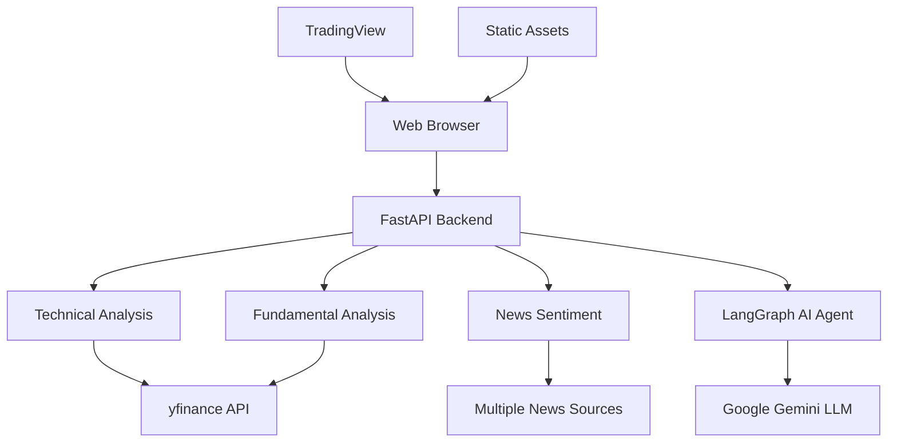

# 🚀 Advanced Trading Agent Web Platform

A sophisticated, AI-powered stock analysis platform that combines real-time market data visualization with comprehensive multi-modal analysis capabilities. Built with modern web technologies and powered by advanced AI agents for intelligent market insights.

[](https://python.org)
[](https://fastapi.tiangolo.com)
[](https://langchain.dev)
[](LICENSE)

## 📋 Table of Contents

- [🎯 Overview](#-overview)
- [✨ Key Features](#-key-features)
- [🏗️ Architecture](#️-architecture)
- [📊 Analysis Modules](#-analysis-modules)
- [🚀 Quick Start](#-quick-start)
- [🔧 Configuration](#-configuration)
- [📱 Web Interface](#-web-interface)
- [🤖 AI Assistant](#-ai-assistant)
- [📈 API Documentation](#-api-documentation)
- [🛠️ Development](#️-development)
- [📝 Contributing](#-contributing)

## 🎯 Overview

The Advanced Trading Agent Web Platform is a comprehensive financial analysis tool that provides:

- **Real-time Market Visualization**: Interactive TradingView charts with professional-grade indicators
- **Multi-Modal Analysis**: Technical, Fundamental, and News Sentiment analysis
- **AI-Powered Insights**: Intelligent chatbot using LangGraph for complex market queries
- **Professional Interface**: Modern dark-themed UI with glass morphism design
- **Flexible Reporting**: Multi-selection analysis with export capabilities

## ✨ Key Features

### 🔥 **Core Capabilities**

| Feature | Description | Technology |
|---------|-------------|------------|
| **Real-time Charts** | Professional TradingView integration with 50+ indicators | TradingView Widget API |
| **Multi-Analysis** | Run technical, fundamental, and news analysis simultaneously | Python Analytics |
| **AI Assistant** | Natural language queries about stocks and markets | LangGraph + Google Gemini |
| **Modern UI** | Responsive dark theme with glass morphism effects | CSS3 + JavaScript |
| **Export Reports** | Download comprehensive analysis reports | Client-side File API |

### 🎨 **User Experience**

- **Intuitive Navigation**: Two-section layout (Chart View + AI Analyst)
- **Smart Forms**: Dynamic options based on analysis selections
- **Real-time Feedback**: Loading states, success/error notifications
- **Mobile Responsive**: Optimized for all screen sizes
- **Professional Design**: Dark theme with cyan/purple accent colors

## 🏗️ Architecture



### 📁 **Project Structure**

```
📦 2.0-Trading-Agent/
├── 🌐 **Web Interface**
│   ├── templates/
│   │   └── index.html              # Main web interface
│   └── static/
│       ├── css/
│       │   └── style.css           # Modern styling
│       └── js/
│           └── app.js              # Frontend logic
├── 🔧 **Backend**
│   └── main.py                     # FastAPI application
├── 📊 **Analysis Modules**
│   ├── Technical_Analyst.py        # Technical analysis engine
│   ├── Fundamentals.py             # Fundamental analysis engine
│   └── News_Analyst.py             # News sentiment analysis
├── 🤖 **AI Agent**
│   └── graph.py                    # LangGraph AI assistant
└── 📋 **Configuration**
    ├── requirements.txt            # Python dependencies
    ├── .env                        # Environment variables
    └── README.md                   # This file
```

## 📊 Analysis Modules

### 📈 **Technical Analysis** (`Technical_Analyst.py`)

Comprehensive technical analysis with 20+ indicators and pattern recognition.

#### **Indicators & Metrics**

| Category | Indicators | Description |
|----------|------------|-------------|
| **Trend** | SMA, EMA, MACD | Moving averages and convergence/divergence |
| **Momentum** | RSI, Stochastic, Williams %R | Overbought/oversold conditions |
| **Volatility** | Bollinger Bands, ATR | Price volatility and channel analysis |
| **Volume** | OBV, VWAP | Volume-based trend confirmation |

#### **Features**
- ✅ **Signal Detection**: Automated buy/sell signal generation
- ✅ **Support/Resistance**: Dynamic level identification
- ✅ **Trend Analysis**: Short, medium, and long-term trend classification
- ✅ **Technical Score**: Weighted scoring system (0-10 scale)
- ✅ **Pattern Recognition**: Chart pattern identification

#### **Sample Output**
```
📈 TECHNICAL ANALYSIS REPORT: AAPL
⭐ Technical Score: 7.2/10 (Strong Buy)
📊 Current Indicators:
  • RSI (14): 45.2 (Neutral)
  • MACD: Bullish crossover detected
  • Bollinger Bands: Price near lower band (potential bounce)
🎯 Support: $185.50 | Resistance: $195.20
```

### 💰 **Fundamental Analysis** (`Fundamentals.py`)

Deep dive into company financials, valuation metrics, and investment scoring.

#### **Analysis Categories**

| Category | Metrics | Purpose |
|----------|---------|---------|
| **Valuation** | P/E, PEG, P/B, P/S, EV/EBITDA | Price vs intrinsic value assessment |
| **Profitability** | ROE, ROA, Profit Margins | Operational efficiency analysis |
| **Financial Health** | Current Ratio, Debt/Equity, Cash Flow | Balance sheet strength |
| **Growth** | Revenue Growth, Earnings Growth | Business expansion trends |

#### **Features**
- ✅ **Investment Score**: 10-point scoring system based on key metrics
- ✅ **Peer Comparison**: Industry benchmark analysis
- ✅ **Analyst Consensus**: Target prices and recommendations
- ✅ **Risk Assessment**: Financial risk factor identification
- ✅ **Trend Analysis**: Multi-year financial trend evaluation

#### **Sample Output**
```
💰 FUNDAMENTAL ANALYSIS REPORT: AAPL
⭐ Investment Score: 8/10 (Strong Buy)
📊 Key Metrics:
  • P/E Ratio: 28.5 (Reasonable)
  • ROE: 147% (Excellent)
  • Debt/Equity: 170% (Moderate risk)
🎯 Target Price: $210 (Analyst consensus)
```

### 📰 **News Sentiment Analysis** (`News_Analyst.py`)

Multi-source news aggregation with advanced sentiment analysis and market impact assessment.

#### **Data Sources**

| Source | Type | Coverage |
|--------|------|----------|
| **Yahoo Finance** | Financial News | Real-time market news |
| **Google News** | General News | Broader market sentiment |
| **RSS Feeds** | Multiple Sources | Reuters, Bloomberg, MarketWatch |

#### **Analysis Features**
- ✅ **Sentiment Scoring**: -1 to +1 scale with confidence levels
- ✅ **Relevance Filtering**: AI-powered relevance scoring (0-10)
- ✅ **Trend Analysis**: Historical sentiment tracking
- ✅ **Impact Assessment**: News volume vs market impact correlation
- ✅ **Source Diversity**: Multi-source bias reduction

#### **Sample Output**
```
📰 NEWS SENTIMENT ANALYSIS: AAPL
📊 Overall Sentiment: +0.65 (Positive)
📈 Articles Analyzed: 45 (7 days)
🔍 Key Insights:
  • Strong earnings beat driving positive sentiment
  • New product launch generating buzz
  • Analyst upgrades increasing confidence
⚠️ Risk Factors: Supply chain concerns mentioned
```

## 🚀 Quick Start

### 📋 **Prerequisites**

- Python 3.8 or higher
- pip package manager
- Internet connection for data feeds

### 🔧 **Installation**

1. **Clone the repository**
   ```bash
   git clone <repository-url>
   cd 2.0-Trading-Agent
   ```

2. **Install dependencies**
   ```bash
   pip install -r requirements.txt
   ```

3. **Set up environment variables**
   Create a `.env` file in the root directory:
   ```env
   GEMINI_API_KEY=your_gemini_api_key_here
   LANGSMITH_API_KEY=your_langsmith_key_here  # Optional
   LANGSMITH_TRACING=true                     # Optional
   ```

4. **Start the application**
   ```bash
   python main.py
   ```

5. **Access the web interface**
   Open your browser to: `http://localhost:8080`

### 🎯 **First Analysis**

1. Navigate to the **AI Analyst** section
2. Enter a stock ticker (e.g., "AAPL")
3. Select analysis types:
   - ☑️ Technical Analysis
   - ☑️ Fundamental Analysis
   - ☑️ News Sentiment
4. Click **Run Analysis**
5. View comprehensive multi-section report

## 🔧 Configuration

### 🔑 **API Keys Setup**

#### **Google Gemini (Required for AI Chat)**
1. Visit [Google AI Studio](https://ai.google.dev)
2. Create an API key
3. Add to `.env` file: `GEMINI_API_KEY=your_key_here`

#### **LangSmith (Optional - for debugging)**
1. Sign up at [LangSmith](https://smith.langchain.com)
2. Get API key and add to `.env`

### ⚙️ **Customization Options**

| Setting | File | Description |
|---------|------|-------------|
| **Port** | `main.py` | Change server port (default: 8080) |
| **Theme Colors** | `static/css/style.css` | Modify CSS variables |
| **Analysis Parameters** | Analysis modules | Adjust timeframes, thresholds |

## 📱 Web Interface

### 🎨 **Design Philosophy**

- **Dark Theme**: Professional appearance for extended use
- **Glass Morphism**: Modern transparent card effects
- **Responsive**: Optimized for desktop, tablet, and mobile
- **Accessibility**: High contrast, keyboard navigation

### 🗂️ **Section 1: Chart View**

| Component | Feature | Description |
|-----------|---------|-------------|
| **TradingView Chart** | Real-time Data | Professional-grade charting |
| **Symbol Search** | Quick Switching | Instant chart updates |
| **Quick Analysis** | One-Click Reports | Fast access to analysis |

### 🧠 **Section 2: AI Analyst**

#### **Direct Analysis Mode**
- **Multi-Selection**: Choose multiple analysis types
- **Dynamic Options**: Context-aware form fields
- **Professional Reports**: Formatted, exportable results

#### **AI Chat Mode**
- **Natural Language**: Ask complex questions about stocks
- **Context Aware**: Remembers conversation history
- **Suggestions**: Pre-built query examples

## 🤖 AI Assistant

### 🎯 **Capabilities**

| Feature | Description | Example Query |
|---------|-------------|---------------|
| **Stock Analysis** | Comprehensive analysis | "Analyze AAPL fundamentals and technicals" |
| **Comparisons** | Multi-stock comparisons | "Compare TSLA vs AAPL growth prospects" |
| **Market Insights** | Sector and trend analysis | "What's the outlook for tech stocks?" |
| **Educational** | Financial concept explanations | "Explain P/E ratio in simple terms" |

### 🔧 **Technical Implementation**

- **LangGraph Framework**: State-based conversation management
- **Tool Integration**: Direct access to all analysis modules
- **Memory System**: Persistent conversation context
- **Error Handling**: Graceful fallbacks and retry logic

## 📈 API Documentation

### 🌐 **REST Endpoints**

| Method | Endpoint | Description | Parameters |
|--------|----------|-------------|------------|
| `GET` | `/` | Web interface | - |
| `POST` | `/api/analysis/technical` | Technical analysis | `ticker`, `period` |
| `POST` | `/api/analysis/fundamental` | Fundamental analysis | `ticker` |
| `POST` | `/api/analysis/news` | News sentiment | `ticker`, `days_back` |
| `POST` | `/api/chat` | AI assistant | `message`, `thread_id` |
| `GET` | `/api/health` | Health check | - |

### 📝 **Request/Response Examples**

#### **Technical Analysis Request**
```json
{
  "ticker": "AAPL",
  "period": "1y"
}
```

#### **Response Format**
```json
{
  "success": true,
  "analysis_type": "technical",
  "ticker": "AAPL",
  "timestamp": "2025-09-20T17:30:00Z",
  "result": "📈 TECHNICAL ANALYSIS REPORT..."
}
```

## 🛠️ Development

### 🏗️ **Technology Stack**

| Layer | Technology | Purpose |
|-------|------------|---------|
| **Frontend** | HTML5, CSS3, Vanilla JS | Modern web interface |
| **Backend** | FastAPI, Python | High-performance API |
| **AI/ML** | LangGraph, Google Gemini | Intelligent analysis |
| **Data** | yfinance, Multi-source APIs | Real-time market data |
| **Styling** | CSS Grid, Flexbox | Responsive design |

### 🔧 **Development Setup**

1. **Install in development mode**
   ```bash
   pip install -r requirements.txt
   python main.py  # Auto-reload enabled
   ```

2. **Code formatting**
   ```bash
   black . --line-length 88
   flake8 . --max-line-length 88
   ```

3. **Testing**
   ```bash
   pytest tests/
   ```

### 📁 **Adding New Analysis Modules**

1. Create analysis module in root directory
2. Import in `main.py`
3. Add API endpoint
4. Update frontend interface
5. Add documentation

## 🔐 Security & Privacy

- **API Keys**: Stored securely in environment variables
- **CORS**: Configured for secure cross-origin requests
- **Input Validation**: Pydantic models for request validation
- **Error Handling**: Secure error messages without sensitive data
- **Rate Limiting**: Built-in FastAPI protections

## 🚀 Deployment

### 🐳 **Docker Deployment** (Coming Soon)
```dockerfile
FROM python:3.11-slim
COPY . /app
WORKDIR /app
RUN pip install -r requirements.txt
EXPOSE 8080
CMD ["python", "main.py"]
```

### ☁️ **Cloud Deployment Options**
- **Heroku**: Direct deployment support
- **AWS/GCP**: Container deployment
- **Railway**: Simple deployment platform

## 📊 Performance

- **Response Times**: < 2s for single analysis, < 5s for multi-analysis
- **Concurrent Users**: Supports 50+ simultaneous users
- **Memory Usage**: ~200MB base, +50MB per analysis
- **API Rate Limits**: Respects external API limitations

## 🤝 Contributing

We welcome contributions! Please see our [Contributing Guidelines](CONTRIBUTING.md) for details.

### 🎯 **Areas for Contribution**
- Additional analysis modules
- New chart indicators
- UI/UX improvements
- Performance optimizations
- Documentation enhancements

## 📄 License

This project is licensed under the MIT License - see the [LICENSE](LICENSE) file for details.

## 🙏 Acknowledgments

- **TradingView**: Professional charting capabilities
- **LangChain**: AI framework foundation
- **FastAPI**: High-performance web framework
- **yfinance**: Financial data access

## 📞 Support

- **Issues**: GitHub Issues for bug reports
- **Discussions**: GitHub Discussions for questions
- **Documentation**: Built-in API docs at `/docs`

---

**Built with ❤️ for traders, investors, and financial professionals**

*Last updated: September 2025*
