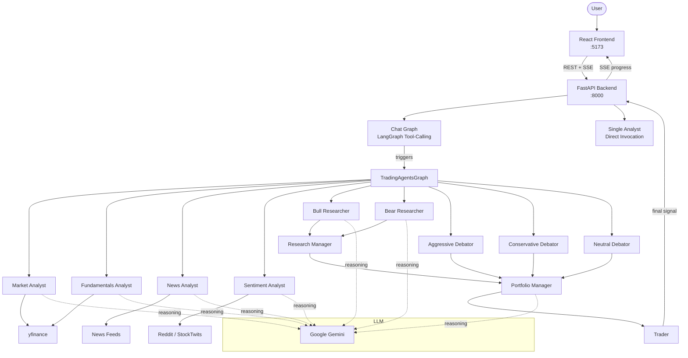

# Trading Agent

An AI-powered stock analysis platform that uses a team of **13 autonomous agents** to debate, research, and produce investment decisions — all orchestrated by [LangGraph](https://langchain.dev) and powered by [Google Gemini](https://ai.google.dev).

The frontend is a modern React + Vite app with real-time TradingView charts, a conversational AI assistant, and live SSE streaming so you can watch the agents think in real time.

## Table of Contents

- [Key Features](#key-features)
- [How the Agents Work](#how-the-agents-work)
- [Tech Stack](#tech-stack)
- [Prerequisites](#prerequisites)
- [Getting Started](#getting-started)
- [Project Structure](#project-structure)
- [Architecture](#architecture)
- [API Reference](#api-reference)
- [Environment Variables](#environment-variables)
- [Deployment](#deployment)
- [Troubleshooting](#troubleshooting)
- [License](#license)

## Key Features

- **Multi-agent debate system** — Bull researchers argue against Bear researchers while Risk Managers evaluate downside. A Portfolio Manager synthesises everything into a final buy / hold / sell signal.
- **4 specialist analysts** — Market, Fundamentals, News, and Sentiment analysts gather data independently and can be invoked individually or as a team.
- **Real-time node visualiser** — An SSE stream pushes agent execution progress to the frontend so the user sees exactly which agent is running at any moment.
- **TradingView charts** — Professional-grade interactive charts embedded directly in the dashboard.
- **Conversational AI assistant** — Chat naturally with the agent team. Ask "Analyze AAPL" and the full 13-agent pipeline runs behind the scenes.
- **Direct analysis mode** — Skip the chat and run any single analyst on a ticker with one click.

## How the Agents Work

When you ask the assistant to analyse a stock, LangGraph orchestrates a multi-step pipeline:

```
┌─────────────────────────────────────────────────────────┐
│                    LangGraph Orchestrator                │
├─────────────────────────────────────────────────────────┤
│                                                         │
│  1. DATA GATHERING (parallel)                           │
│     ├── Market Analyst ──── yfinance, stockstats        │
│     ├── Fundamentals Analyst ── balance sheet, cashflow │
│     ├── News Analyst ────── news feeds, insider txns    │
│     └── Sentiment Analyst ── social media, Reddit       │
│                                                         │
│  2. RESEARCH PHASE                                      │
│     ├── Bull Researcher ── builds the bull case          │
│     └── Bear Researcher ── builds the bear case          │
│                                                         │
│  3. INVESTMENT DEBATE                                   │
│     ├── Research Manager ── moderates bull vs bear       │
│     └── Reflection ──────── checks for blind spots      │
│                                                         │
│  4. RISK DEBATE                                         │
│     ├── Aggressive Debator                              │
│     ├── Conservative Debator                            │
│     └── Neutral Debator                                 │
│                                                         │
│  5. DECISION                                            │
│     ├── Portfolio Manager ── final buy/hold/sell signal  │
│     └── Trader ──────────── execution-level details     │
│                                                         │
└─────────────────────────────────────────────────────────┘
```

Each step writes its findings into the shared LangGraph state. The Portfolio Manager reads all analyst reports, both sides of the debate, and the risk assessment before issuing a final signal.

## Tech Stack

| Layer | Technology | Purpose |
|-------|------------|---------|
| **Frontend** | React 18, Vite 5, Framer Motion | Single-page app with animations |
| **Charting** | TradingView Widget API | Professional candlestick charts |
| **3D Visuals** | Three.js, React Three Fiber | Hero scene and globe visualisations |
| **Backend** | FastAPI, Uvicorn | High-performance async API |
| **AI Orchestration** | LangGraph | Multi-agent graph execution |
| **LLM** | Google Gemini (via LangChain) | Reasoning across all agents |
| **Market Data** | yfinance, Alpha Vantage | OHLCV, fundamentals, financials |
| **News / Sentiment** | Yahoo Finance News, Reddit, StockTwits | Multi-source news aggregation |
| **Caching** | Redis (optional) | Response caching with configurable TTLs |
| **Styling** | Tailwind CSS 3, custom dark theme | Glassmorphism design system |

## Prerequisites

- **Python 3.11+** (3.12 recommended)
- **Node.js 18+** and npm
- **A Google Gemini API key** — get one free at [Google AI Studio](https://ai.google.dev)
- **Redis** (optional) — for caching; the app works without it

## Getting Started

### 1. Clone the repository

```bash
git clone <repository-url>
cd 2.0-Trading-Agent
```

### 2. Set up the backend

```bash
cd backend

# Create your environment file
cp .env.example .env
```

Open `.env` and add your Gemini key:

```env
GEMINI_API_KEY=your_key_here
```

Install dependencies with [uv](https://docs.astral.sh/uv/) (recommended) or pip:

```bash
# Option A: uv (fast)
uv sync

# Option B: pip
pip install -r requirements.txt
```

Start the backend:

```bash
python -m app.main
```

The API starts on **http://localhost:8000**. Interactive docs are at **http://localhost:8000/docs**.

### 3. Set up the frontend

Open a new terminal:

```bash
cd frontend
npm install
npm run dev
```

The frontend starts on **http://localhost:5173**.

### 4. Open the app

Navigate to **http://localhost:5173** in your browser. You will see the dashboard with a TradingView chart on the left and the AI assistant on the right.

### 5. Run your first analysis

**Option A — Chat:** Type `Analyze AAPL comprehensively` in the chat. The full 13-agent pipeline runs and you can watch the agent tags appear in real time.

**Option B — Direct:** Navigate to the **Analysis** page, enter a ticker, and select which analysts to run. Results appear side-by-side.

## Project Structure

```
2.0-Trading-Agent/
├── frontend/                          # React + Vite SPA
│   ├── src/
│   │   ├── components/
│   │   │   ├── ChartView.jsx          # TradingView widget wrapper
│   │   │   ├── ChatInterface.jsx      # AI chat + SSE node visualiser
│   │   │   ├── AnalysisForm.jsx       # Direct multi-analyst form
│   │   │   └── ResultsDisplay.jsx     # Formatted markdown results
│   │   ├── pages/
│   │   │   └── EventsPage.jsx         # Market events map (optional)
│   │   ├── services/
│   │   │   └── api.js                 # Axios client + SSE helper
│   │   ├── styles/
│   │   │   └── index.css              # Design system tokens
│   │   └── App.jsx                    # Root layout + routing
│   ├── package.json
│   └── vite.config.js
│
├── backend/                           # FastAPI backend
│   ├── app/
│   │   ├── config/
│   │   │   └── settings.py            # Centralised env-var config
│   │   ├── routes/
│   │   │   ├── analysis.py            # POST /api/analysis/{type}
│   │   │   ├── chat.py                # POST /api/chat + SSE stream
│   │   │   └── health.py              # GET /api/health + /api/tickers
│   │   ├── tradingagents/             # ← The agent framework
│   │   │   ├── agents/
│   │   │   │   ├── analysts/          # Market, Fundamentals, News, Sentiment
│   │   │   │   ├── researchers/       # Bull Researcher, Bear Researcher
│   │   │   │   ├── managers/          # Portfolio Manager, Research Manager
│   │   │   │   ├── risk_mgmt/        # Aggressive, Conservative, Neutral
│   │   │   │   └── trader/            # Trader agent
│   │   │   ├── dataflows/             # yfinance, Alpha Vantage, Reddit, StockTwits
│   │   │   ├── graph/                 # LangGraph wiring, state, propagation
│   │   │   │   ├── trading_graph.py   # TradingAgentsGraph (main class)
│   │   │   │   ├── setup.py           # Graph node + edge builder
│   │   │   │   └── signal_processing.py
│   │   │   ├── chat_graph.py          # LangGraph chatbot with tool-calling
│   │   │   └── single_analyst_graph.py # Run one analyst in isolation
│   │   ├── models/                    # Pydantic request/response schemas
│   │   ├── utils/                     # Ticker validator, SSE progress store
│   │   └── main.py                    # FastAPI entrypoint
│   ├── pyproject.toml
│   └── Dockerfile
│
├── Dockerfile                         # Root Dockerfile (HF Spaces)
└── README.md                          # ← You are here
```

## Architecture


```mermaid
graph TB
    User([User]) --> FE[React Frontend<br/>:5173]
    FE -->|REST + SSE| API[FastAPI Backend<br/>:8000]

    API --> CG[Chat Graph<br/>LangGraph Tool-Calling]
    API --> SA[Single Analyst<br/>Direct Invocation]

    CG -->|triggers| TAG[TradingAgentsGraph]

    TAG --> MA[Market Analyst]
    TAG --> FA[Fundamentals Analyst]
    TAG --> NA[News Analyst]
    TAG --> SN[Sentiment Analyst]

    MA --> YF[yfinance]
    FA --> YF
    NA --> NF[News Feeds]
    SN --> RD[Reddit / StockTwits]

    TAG --> BR[Bull Researcher]
    TAG --> BE[Bear Researcher]
    BR --> RM[Research Manager]
    BE --> RM

    TAG --> AD[Aggressive Debator]
    TAG --> CD[Conservative Debator]
    TAG --> ND[Neutral Debator]

    RM --> PM[Portfolio Manager]
    AD --> PM
    CD --> PM
    ND --> PM
    PM --> TR[Trader]

    TR -->|final signal| API
    API -->|SSE progress| FE

    subgraph LLM
        Gemini[Google Gemini]
    end

    MA -.->|reasoning| Gemini
    FA -.->|reasoning| Gemini
    NA -.->|reasoning| Gemini
    SN -.->|reasoning| Gemini
    BR -.->|reasoning| Gemini
    BE -.->|reasoning| Gemini
    PM -.->|reasoning| Gemini
```

### Request Lifecycle

1. **User sends a chat message** (e.g. "Analyze TSLA") via `POST /api/chat`.
2. **Chat Graph** (a LangGraph tool-calling agent) identifies the `run_comprehensive_analysis` tool and calls it.
3. **TradingAgentsGraph** spins up the 13-agent pipeline. As each node starts, a `NodeProgressCallbackHandler` pushes its name into an in-memory `ProgressStore`.
4. **Frontend** has an open `EventSource` on `GET /api/chat/stream/{thread_id}` and renders animated agent tags as they arrive.
5. **Portfolio Manager** aggregates all findings and returns a buy / hold / sell signal.
6. **Chat response** is sent back with the full report in markdown.

## API Reference

| Method | Endpoint | Description |
|--------|----------|-------------|
| `POST` | `/api/chat` | Send a message to the AI assistant. Triggers the full multi-agent pipeline when appropriate. |
| `GET` | `/api/chat/stream/{thread_id}` | SSE stream of currently executing agent nodes. Connect before sending the chat message. |
| `POST` | `/api/analysis/market` | Run the Market Analyst on a ticker. |
| `POST` | `/api/analysis/fundamentals` | Run the Fundamentals Analyst on a ticker. |
| `POST` | `/api/analysis/news` | Run the News Analyst on a ticker. |
| `POST` | `/api/analysis/sentiment` | Run the Sentiment Analyst on a ticker. |
| `GET` | `/api/health` | Health check. Returns `{ status: "healthy" }`. |
| `GET` | `/api/tickers` | List of popular tickers for autocomplete. |
| `GET` | `/` | API root. Returns version info. |

### Example: Run a single analyst

```bash
curl -X POST http://localhost:8000/api/analysis/market \
  -H "Content-Type: application/json" \
  -d '{"ticker": "AAPL"}'
```

### Example: Chat with the assistant

```bash
curl -X POST http://localhost:8000/api/chat \
  -H "Content-Type: application/json" \
  -d '{"message": "Analyze NVDA comprehensively", "thread_id": "my-session"}'
```

## Environment Variables

All configuration is managed through a single `.env` file in the `backend/` directory.

### Required

| Variable | Description | How to get it |
|----------|-------------|---------------|
| `GEMINI_API_KEY` | Google Gemini API key | [Google AI Studio](https://ai.google.dev) |

### Optional

| Variable | Description | Default |
|----------|-------------|---------|
| `NEWS_API_KEY` | News API key for additional sources | — |
| `LANGSMITH_API_KEY` | LangSmith tracing key | — |
| `LANGSMITH_TRACING` | Enable LangSmith tracing | `false` |
| `BACKEND_PORT` | Port the API listens on | `8000` |
| `CORS_ORIGINS` | Comma-separated allowed origins | `http://localhost:5173,http://localhost:3000` |
| `REDIS_URL` | Redis connection string | `redis://localhost:6379/0` |
| `REDIS_ENABLED` | Enable Redis caching | `true` |
| `CACHE_TTL_OHLCV` | Cache TTL for price data (seconds) | `900` (15 min) |
| `CACHE_TTL_FUNDAMENTALS` | Cache TTL for fundamentals (seconds) | `3600` (1 hr) |
| `CACHE_TTL_NEWS` | Cache TTL for news (seconds) | `300` (5 min) |
| `EVENTS_ENABLED` | Mount the Event Map routes | `false` |
| `SUPABASE_URL` | Supabase project URL (for Event Map) | — |
| `SUPABASE_ANON_KEY` | Supabase anon key (for Event Map) | — |
| `DEBUG` | Enable debug mode + hot reload | `false` |
| `LOG_LEVEL` | Logging level | `info` |

### Frontend

Create a `.env` file in `frontend/`:

```env
VITE_API_URL=http://localhost:8000
```

For production, point it at your deployed backend URL.

## Deployment

### Docker (Hugging Face Spaces)

A root `Dockerfile` is included for deployment to Hugging Face Spaces:

```bash
docker build -t trading-agent .
docker run -p 7860:7860 --env-file backend/.env trading-agent
```

### Docker (Backend only)

```bash
cd backend
docker build -t trading-agent-backend .
docker run -p 8000:8000 --env-file .env trading-agent-backend
```

### Frontend (Static Hosting)

Build the frontend and deploy the `dist/` folder to Vercel, Netlify, or any static host:

```bash
cd frontend
VITE_API_URL=https://your-backend.com npm run build
# Deploy dist/ to your host
```

## Troubleshooting

### Backend won't start

**Error:** `ModuleNotFoundError: No module named 'app'`

**Fix:** Make sure you run from the `backend/` directory:

```bash
cd backend
python -m app.main
```

### Gemini API errors

**Error:** `google.api_core.exceptions.PermissionDenied`

**Fix:** Check that `GEMINI_API_KEY` is set correctly in `backend/.env` and the key is active in [Google AI Studio](https://ai.google.dev).

### Frontend can't reach backend

**Error:** Network errors or CORS failures in the browser console.

**Fix:**
1. Verify the backend is running on port 8000.
2. Check `VITE_API_URL` in `frontend/.env` matches the backend URL.
3. Ensure `CORS_ORIGINS` in `backend/.env` includes your frontend URL.

### Redis connection refused

**Error:** `ConnectionRefusedError: [Errno 111] Connection refused`

**Fix:** Either start Redis or disable it:

```env
REDIS_ENABLED=false
```

## License

MIT License — see [LICENSE](LICENSE) for details.
