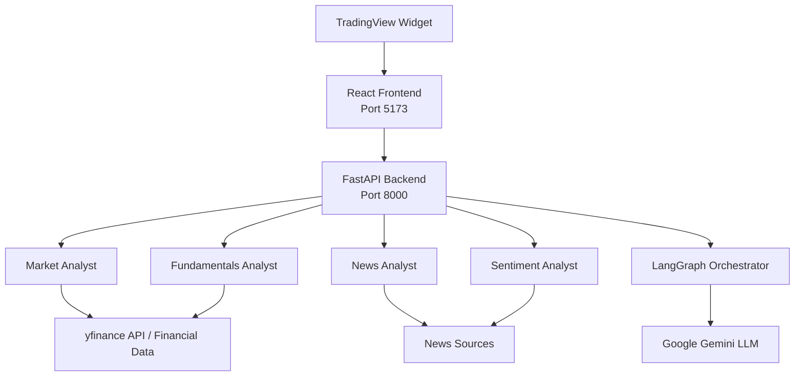

# 🚀 Trading Agent - AI-Powered Stock Analysis Platform

A sophisticated, production-ready stock analysis platform with **separate frontend and backend architecture**. Combines real-time market data visualization with comprehensive multi-modal analysis capabilities. Built with React + Vite frontend and FastAPI backend, powered by advanced AI agents for intelligent market insights.

[](https://python.org)
[](https://react.dev)
[](https://fastapi.tiangolo.com)
[](https://langchain.dev)
[](LICENSE)

## 📋 Table of Contents

- [🎯 Overview](#-overview)
- [✨ Key Features](#-key-features)
- [🏗️ Architecture](#️-architecture)
- [📊 Analysis Modules](#-analysis-modules)
- [🚀 Quick Start](#-quick-start)
- [🔧 Configuration](#-configuration)
- [📱 Web Interface](#-web-interface)
- [🤖 AI Assistant](#-ai-assistant)
- [📈 API Documentation](#-api-documentation)
- [🛠️ Development](#️-development)
- [📝 Contributing](#-contributing)

## 🎯 Overview

The Advanced Trading Agent Web Platform is a comprehensive financial analysis tool that provides:

- **Real-time Market Visualization**: Interactive TradingView charts with professional-grade indicators
- **Multi-Modal Analysis**: Technical, Fundamental, and News Sentiment analysis
- **AI-Powered Insights**: Intelligent chatbot using LangGraph for complex market queries
- **Professional Interface**: Modern dark-themed UI with glass morphism design
- **Flexible Reporting**: Multi-selection analysis with export capabilities

## ✨ Key Features

### 🔥 **Core Capabilities**

| Feature | Description | Technology |
|---------|-------------|------------|
| **Real-time Charts** | Professional TradingView integration with 50+ indicators | TradingView Widget API |
| **Multi-Analysis** | Run technical, fundamental, and news analysis simultaneously | Python Analytics |
| **AI Assistant** | Natural language queries about stocks and markets | LangGraph + Google Gemini |
| **Modern UI** | Responsive dark theme with glass morphism effects | CSS3 + JavaScript |
| **Export Reports** | Download comprehensive analysis reports | Client-side File API |

### 🎨 **User Experience**

- **Intuitive Navigation**: Two-section layout (Chart View + AI Analyst)
- **Smart Forms**: Dynamic options based on analysis selections
- **Real-time Feedback**: Loading states, success/error notifications
- **Mobile Responsive**: Optimized for all screen sizes
- **Professional Design**: Dark theme with cyan/purple accent colors

## 🏗️ Architecture

### **Frontend-Backend Separation**


```mermaid
graph TB
    A[React Frontend<br/>Port 5173] --> B[FastAPI Backend<br/>Port 8000]
    B --> C[Market Analyst]
    B --> D[Fundamentals Analyst]
    B --> E[News Analyst]
    B --> F[Sentiment Analyst]
    B --> K[LangGraph Orchestrator]
    
    C --> G[yfinance API / Financial Data]
    D --> G
    E --> H[News Sources]
    F --> H
    K --> I[Google Gemini LLM]
    
    J[TradingView Widget] --> A
```

### 📁 **Project Structure**

```
📦 2.0-Trading-Agent/
├── 📱 **frontend/**                    # React + Vite Frontend
│   ├── src/
│   │   ├── components/                # React components
│   │   │   ├── ChartView.jsx
│   │   │   ├── AIAnalyst.jsx
│   │   │   ├── AnalysisForm.jsx
│   │   │   ├── ChatInterface.jsx
│   │   │   └── ResultsDisplay.jsx
│   │   ├── services/                  # API integration
│   │   │   └── api.js
│   │   ├── styles/                    # CSS styles
│   │   ├── config/                    # Constants
│   │   ├── App.jsx
│   │   └── main.jsx
│   ├── public/
│   ├── package.json
│   ├── vite.config.js
│   └── README.md
│
├── 🔧 **backend/**                     # FastAPI Backend
│   ├── app/
│   │   ├── config/                    # Settings & env config
│   │   ├── routes/                    # API endpoints
│   │   │   ├── analysis.py
│   │   │   ├── chat.py
│   │   │   └── health.py
│   │   ├── core/                      # Core models and logic
│   │   ├── tradingagents/             # LangGraph AI Agents
│   │   │   ├── agents/                # Individual analysts (market, fundamentals, news, sentiment)
│   │   │   ├── dataflows/             # Data fetching and ingestion tools
│   │   │   ├── graph/                 # Main graph execution and state
│   │   │   └── chat_graph.py          # AI Assistant orchestrator
│   │   ├── models/                    # Pydantic schemas
│   │   ├── utils/                     # Utilities
│   │   └── main.py
│   ├── pyproject.toml                 # uv dependencies
│   ├── Dockerfile
│   └── README.md
│
└── 📋 **Root**
    ├── README.md                      # This file
    └── .gitignore
```

## 📊 Analysis Modules

### 📈 **Market Analysis** (`market_analyst.py`)

Comprehensive market analysis tracking price action, trends, and support/resistance.

#### **Features**
- ✅ **Signal Detection**: Automated buy/sell signal generation
- ✅ **Technical Score**: Weighted scoring system
- ✅ **Pattern Recognition**: Support and resistance levels

### 💰 **Fundamental Analysis** (`fundamentals_analyst.py`)

Deep dive into company financials, valuation metrics, and balance sheets.

#### **Features**
- ✅ **Investment Score**: Scoring system based on key metrics
- ✅ **Financial Health**: Cash flow and income statements
- ✅ **Risk Assessment**: Financial risk factor identification

### 📰 **News Analysis** (`news_analyst.py`)

Multi-source news aggregation identifying macro trends and insider transactions.

#### **Features**
- ✅ **Global & Local Impact**: Analyzes specific company news vs global news
- ✅ **Insider Tracking**: Monitors insider trades
- ✅ **Risk Factors**: Identifies regulatory or supply chain concerns

### 🧠 **Sentiment Analysis** (`sentiment_analyst.py`)

Evaluates market psychology and social sentiment for the asset.

#### **Features**
- ✅ **Sentiment Scoring**: Positive/Negative outlook scaling
- ✅ **Trend Analysis**: Identifying retail vs institutional sentiment
- ✅ **Impact Assessment**: Correlating sentiment with price action

## 🚀 Quick Start

### 📋 **Prerequisites**

- **Backend**: Python 3.12+, uv (recommended) or pip
- **Frontend**: Node.js 18+, npm/yarn/pnpm
- Internet connection for data feeds

### 🔧 **Installation**

#### **Option 1: Run Both (Development)**

1. **Clone the repository**
   ```bash
   git clone <repository-url>
   cd 2.0-Trading-Agent
   ```

2. **Setup Backend**
   ```bash
   cd backend
   cp .env.example .env
   # Edit .env and add your GEMINI_API_KEY
   
   # Install with uv (recommended)
   uv sync
   
   # Or with pip
   pip install -r requirements.txt
   
   # Start backend server
   python -m app.main
   ```
   Backend runs on: http://localhost:8000

3. **Setup Frontend** (in a new terminal)
   ```bash
   cd frontend
   npm install
   npm run dev
   ```
   Frontend runs on: http://localhost:5173

4. **Access the application**
   Open your browser to: http://localhost:5173

#### **Option 2: Backend Only (API)**

```bash
cd backend
cp .env.example .env
# Add your API keys to .env
uv sync
python -m app.main
```

Access API docs at: http://localhost:8000/docs

#### **Option 3: Docker (Backend)**

```bash
cd backend
docker build -t trading-agent-backend .
docker run -p 8000:8000 --env-file .env trading-agent-backend
```

### 🎯 **First Analysis**

1. Navigate to the **Chart View** section
2. View real-time TradingView charts
3. Switch to **AI Analyst** section
4. Enter a stock ticker (e.g., "AAPL")
5. Select analysis types:
   - ☑️ Technical Analysis
   - ☑️ Fundamental Analysis
   - ☑️ News Sentiment
6. Click **Run Analysis**
7. View comprehensive multi-section report

## 🔧 Configuration

### 🔑 **API Keys Setup**

#### **Google Gemini (Required for AI Chat)**
1. Visit [Google AI Studio](https://ai.google.dev)
2. Create an API key
3. Add to `.env` file: `GEMINI_API_KEY=your_key_here`

#### **LangSmith (Optional - for debugging)**
1. Sign up at [LangSmith](https://smith.langchain.com)
2. Get API key and add to `.env`

### ⚙️ **Customization Options**

| Setting | File | Description |
|---------|------|-------------|
| **Port** | `main.py` | Change server port (default: 8080) |
| **Theme Colors** | `static/css/style.css` | Modify CSS variables |
| **Analysis Parameters** | Analysis modules | Adjust timeframes, thresholds |

## 📱 Web Interface

### 🎨 **Design Philosophy**

- **Dark Theme**: Professional appearance for extended use
- **Glass Morphism**: Modern transparent card effects
- **Responsive**: Optimized for desktop, tablet, and mobile
- **Accessibility**: High contrast, keyboard navigation

### 🗂️ **Section 1: Chart View**

| Component | Feature | Description |
|-----------|---------|-------------|
| **TradingView Chart** | Real-time Data | Professional-grade charting |
| **Symbol Search** | Quick Switching | Instant chart updates |
| **Quick Analysis** | One-Click Reports | Fast access to analysis |

### 🧠 **Section 2: AI Analyst**

#### **Direct Analysis Mode**
- **Multi-Selection**: Choose multiple analysis types
- **Dynamic Options**: Context-aware form fields
- **Professional Reports**: Formatted, exportable results

#### **AI Chat Mode**
- **Natural Language**: Ask complex questions about stocks
- **Context Aware**: Remembers conversation history
- **Suggestions**: Pre-built query examples

## 🤖 AI Assistant

### 🎯 **Capabilities**

| Feature | Description | Example Query |
|---------|-------------|---------------|
| **Stock Analysis** | Comprehensive analysis | "Analyze AAPL fundamentals and technicals" |
| **Comparisons** | Multi-stock comparisons | "Compare TSLA vs AAPL growth prospects" |
| **Market Insights** | Sector and trend analysis | "What's the outlook for tech stocks?" |
| **Educational** | Financial concept explanations | "Explain P/E ratio in simple terms" |

### 🔧 **Technical Implementation**

- **LangGraph Framework**: State-based conversation management
- **Tool Integration**: Direct access to all analysis modules
- **Memory System**: Persistent conversation context
- **Error Handling**: Graceful fallbacks and retry logic

## 📈 API Documentation

### 🌐 **REST Endpoints**

| Method | Endpoint | Description | Parameters |
|--------|----------|-------------|------------|
| `GET` | `/` | Web interface | - |
| `POST` | `/api/analysis/{type}` | Single agent analysis (market, fundamentals, news, sentiment) | `ticker` |
| `POST` | `/api/chat` | AI assistant (orchestrates full multi-agent debate) | `message`, `thread_id` |
| `GET` | `/api/chat/stream/{thread_id}` | Live SSE streaming of active nodes | - |
| `GET` | `/api/health` | Health check | - |

### 📝 **Request/Response Examples**

#### **Technical Analysis Request**
```json
{
  "ticker": "AAPL",
  "period": "1y"
}
```

#### **Response Format**
```json
{
  "success": true,
  "analysis_type": "technical",
  "ticker": "AAPL",
  "timestamp": "2025-09-20T17:30:00Z",
  "result": "📈 TECHNICAL ANALYSIS REPORT..."
}
```

## 🛠️ Development

### 🏗️ **Technology Stack**

| Layer | Technology | Purpose |
|-------|------------|---------|
| **Frontend** | HTML5, CSS3, Vanilla JS | Modern web interface |
| **Backend** | FastAPI, Python | High-performance API |
| **AI/ML** | LangGraph, Google Gemini | Intelligent analysis |
| **Data** | yfinance, Multi-source APIs | Real-time market data |
| **Styling** | CSS Grid, Flexbox | Responsive design |

### 🔧 **Development Setup**

1. **Install in development mode**
   ```bash
   pip install -r requirements.txt
   python main.py  # Auto-reload enabled
   ```

2. **Code formatting**
   ```bash
   black . --line-length 88
   flake8 . --max-line-length 88
   ```

3. **Testing**
   ```bash
   pytest tests/
   ```

### 📁 **Adding New Analysis Modules**

1. Create analysis module in root directory
2. Import in `main.py`
3. Add API endpoint
4. Update frontend interface
5. Add documentation

## 🔐 Security & Privacy

- **API Keys**: Stored securely in environment variables
- **CORS**: Configured for secure cross-origin requests
- **Input Validation**: Pydantic models for request validation
- **Error Handling**: Secure error messages without sensitive data
- **Rate Limiting**: Built-in FastAPI protections

## 🚀 Deployment

### 🐳 **Docker Deployment** (Coming Soon)
```dockerfile
FROM python:3.11-slim
COPY . /app
WORKDIR /app
RUN pip install -r requirements.txt
EXPOSE 8080
CMD ["python", "main.py"]
```

### ☁️ **Cloud Deployment Options**
- **Heroku**: Direct deployment support
- **AWS/GCP**: Container deployment
- **Railway**: Simple deployment platform

## 📊 Performance

- **Response Times**: < 2s for single analysis, < 5s for multi-analysis
- **Concurrent Users**: Supports 50+ simultaneous users
- **Memory Usage**: ~200MB base, +50MB per analysis
- **API Rate Limits**: Respects external API limitations

## 🤝 Contributing

We welcome contributions! Please see our [Contributing Guidelines](CONTRIBUTING.md) for details.

### 🎯 **Areas for Contribution**
- Additional analysis modules
- New chart indicators
- UI/UX improvements
- Performance optimizations
- Documentation enhancements

## 📄 License

This project is licensed under the MIT License - see the [LICENSE](LICENSE) file for details.

## 🙏 Acknowledgments

- **TradingView**: Professional charting capabilities
- **LangChain**: AI framework foundation
- **FastAPI**: High-performance web framework
- **yfinance**: Financial data access

## 📞 Support

- **Issues**: GitHub Issues for bug reports
- **Discussions**: GitHub Discussions for questions
- **Documentation**: Built-in API docs at `/docs`

---

**Built with ❤️ for traders, investors, and financial professionals**

*Last updated: September 2025*
